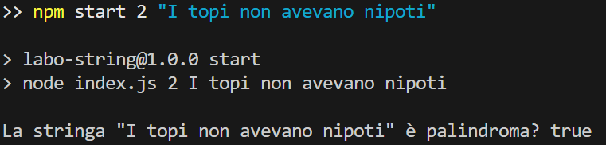

# [5577783] Labo-String – CLI per utilità su stringhe


## 📚 Descrizione
**Labo-String** è una Command Line Interface (CLI) realizzata in Node.js che fornisce funzionalità utili per l'elaborazione di stringhe.

## 🔧 Funzionalità
Il programma supporta le seguenti operazioni:

- 🔁 **Inversione di una stringa**
- 🔍 **Verifica se una stringa è palindroma** (ignorando spazi e maiuscole)
- ✂️ **Troncamento di una stringa** a una lunghezza massima, con `...`
- #️⃣ **Conteggio delle occorrenze** di ogni carattere

## 📁 Struttura del Progetto

```
 Labo-String
├── 📂 src                 # Codice sorgente
│   └── stringUtils.js    # Funzioni principali per la manipolazione di stringhe
├── 📂 __tests__           # Test unitari
│   └── stringUtils.test.js # Test automatizzati con Jest
├── 📂 .github
│   └── 📂 workflows
│       └── ci.yml        # Workflow GitHub Actions per test e report coverage
├── 📂 media              # Risorse multimediali
│   └── demo.jpg          # Screenshot dimostrativo della CLI
├── index.js              # Entry point CLI
└── package.json          # Configurazione progetto Node.js e script npm
```

## ▶️ Utilizzo

### 📦 1. Installazione dipendenze
```bash
npm ci
```

### 🚀 2. Esecuzione da terminale
```bash
npm start <numero_funzione> <stringa_input> [parametro_aggiuntivo]
```

### 📌 Esempi
```bash
npm start 1 "ciao"          # Output: oaic
npm start 2 "I topi non avevano nipoti"  # Output: true
npm start 3 "questa è una prova" 10      # Output: questa è u...
npm start 4 "banana"        # Output: { b: 1, a: 3, n: 2 }
```
## 📸 Screenshot della CLI

Ecco un esempio di utilizzo reale della CLI per la funzione 2:



## 🧪 Test

### ✔️ Eseguire i test:
```bash
npm test
```

### 📈 Test con coverage:
```bash
npm run test:coverage
```

✔️ La **copertura dei test** è al **100%** per tutte le funzioni del modulo `stringUtils.js`.

## 🔁 CI/CD con GitHub Actions

Il progetto è dotato di un workflow CI che automatizza:

- il checkout del codice
- l'installazione delle dipendenze
- l'esecuzione dei test con coverage
- il caricamento del report HTML come artefatto

### ✅ Compatibilità testata automaticamente su:
- Node.js `18.x`
- Node.js `20.x` *(LTS attuale)*
- Node.js `21.x`

📂 Il **report HTML** completo è scaricabile dalla sezione "Actions" di ogni esecuzione nella tab di GitHub, ed è mantenuto per 5 giorni.


## 🛠️ Tecnologie Utilizzate
- **Node.js** (≥ 18.x)
- **Jest** (per testing e coverage)
- **GitHub Actions** (per CI/CD)
- **npm scripts** (per gestione locale del flusso di sviluppo)

---

🧑‍🎓 *Progetto sviluppato da Eugenio Vassallo – Matricola 5577783*
